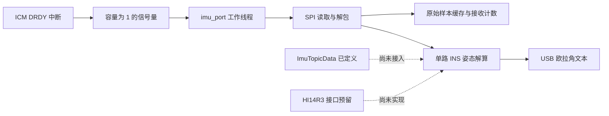
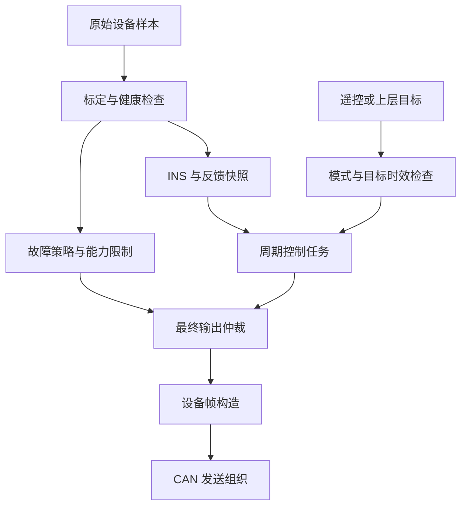

# Dust_HeavyHero：机器人架构、故障管理与多 IMU 姿态融合设计

编写日期：2026-10-01。本文由 AI 辅助分析当前工作区源码并编写。

本文面向 RoboMaster 机器人中的感知、底盘和一般运动机构软件设计，结合 ArduPilot 的分层、估计器健康管理和失效处理思想，给出适合本工程的落地路线。

**当前 App 层电机控制尚未编写。** 文中涉及控制任务、模式管理、输出仲裁的内容均为后续设计建议，不代表已经存在的功能。

本文的核查方式是源码阅读、编译数据库检查和孤立公式的数值计算，没有重新编译固件，没有进行板上运行、传感器标定或整机测试。现有代码中的问题在本文中记录，本次没有修改业务源码。

## 1. 工程现状与设计边界

### 1.1 实际平台

本工程采用 **HPM5361、RISC-V、Zephyr、CMake/Kconfig/Devicetree**。根目录 CMake 引入本机 HPM SDK glue，现有编译数据库使用 `riscv64-zephyr-elf-gcc.exe`。这与此前讨论中的 STM32 示例不同，不能直接套用 STM32 HAL 或 FreeRTOS 的具体 API。

硬件选择、引脚和启用状态主要放在 `Board/`、各目录的 `.overlay` 和 `.conf` 文件中；算法与应用逻辑尽量保持平台无关。

### 1.2 已实现、预留与尚未实现

| 内容 | 当前状态 | 源码依据 |
| --- | --- | --- |
| 启动入口 | 初始化串口、CAN、遥控、INS、IMU、USB；主循环显示 CPU 负载 | [main.cpp](../App/core/main.cpp) |
| ICM 采集 | DRDY 信号量唤醒线程，同步 SPI 读取与解包 | [ICM 驱动](../Device/imu/icm42688p_hxy/icm42688p_hxy.cpp) |
| IMU 工作线程 | 保存原始采样、计数、计算处理间隔并调用 INS；抽样输出 USB 文本 | [imu_port.cpp](../Communication/imu_port/imu_port.cpp) |
| 当前姿态解算 | 单个 `attitude_estimator`，轴向变换、逐轴滤波、重力方向反馈、四元数预测 | [ins.cpp](../Module/ins/ins.cpp) |
| 通用四元数算法 | 存在独立 `quaternion` 类，并加入构建；当前 INS 没有调用该类 | [quaternion.cpp](../Algorithm/quaternion/quaternion.cpp) |
| IMU Topic | 有四元数、物理量、有效标志和时间戳字段；尚未接入当前采样链路 | [imu_chan.hpp](../Topic/imu_chan/imu_chan.hpp) |
| 遥控采集 | 独立线程、帧解析、缓存和计数 | [remote_port.cpp](../Communication/remote_port/remote_port.cpp) |
| 电机与 CAN | 有设备反馈解析、指令帧构造、收发组织、队列和总线恢复 | [fdcan_port.cpp](../Communication/fdcan_port/fdcan_port.cpp) |
| CAN Topic | 反馈与控制实际使用 `k_msgq`；与 IMU/遥控的 Zephyr zbus 通道不同 | [fdcan_chan.cpp](../Topic/fdcan_chan/fdcan_chan.cpp) |
| Supervisor | 当前监测 CPU 忙碌占比并更新 LED，尚无统一设备离线管理 | [cpu_usage.hpp](../daemon_supervisor/cpu_usage.hpp) |
| HI14R3 + ICM | Kconfig 与 UART 别名预留；组合选项仍只编译和采集 ICM | [IMU Kconfig](../Device/imu/Kconfig)、[IMU CMake](../Device/imu/CMakeLists.txt) |
| HI14R3 驱动 | 目录中有规格书，尚无已接入的驱动和融合实现 | [HI14 规格书](../Device/imu/hi14r3/hi14_datasheet_cn.pdf) |
| App 电机控制 | 尚未实现；`app_chassis.cpp/.hpp` 当前为空 | [底盘 App](../App/app_chassis/app_chassis.cpp) |

`Module/input/input.cpp`、`Module/control/control.cpp`、`Module/pc/pc.cpp` 也尚无业务实现。目录存在、源文件加入构建、Kconfig 有选项，都不等于运行链路已经完成。

### 1.3 当前运行链路



当前 `imu_topic_publish()` 没有被这条链路调用。主线程的 CPU 显示函数内部休眠 500 ms，不能直接承担高频控制或快速失联检查。

## 2. 借鉴 ArduPilot 时应该保留什么

ArduPilot 把硬件访问、设备驱动、状态估计、控制算法、行为模式和载具故障动作分开。设备库检测健康状态，载具层根据模式及配置决定失效动作。

它同时具有应用任务表调度和平台线程调度；EKF3 可以并行运行多个估计器通道，根据健康状态与误差表现选择主通道。多 IMU 的价值包括故障隔离和冗余，并不等于把所有测量直接取平均。

本工程已有分层基础，可以按现有目录继续组织：

| 目录 | 建议保持的职责 | 不宜承担的职责 |
| --- | --- | --- |
| `Board` | 板卡、链接和硬件描述 | 控制策略 |
| `Bsp` | Zephyr 外设访问、缓冲、中断、传输 | 判断机器人应该进入哪个模式 |
| `Device` | 芯片寄存器、协议、设备反馈和能力 | 系统级故障仲裁 |
| `Communication` | 收发线程、解包组织、发布采样 | 长时间占用采样线程的调试输出 |
| `Topic` | 明确消息格式、快照或队列语义 | 在消息层执行复杂估计算法 |
| `Algorithm` | 数学、滤波、四元数等可测试算法 | 直接访问设备和控制总线 |
| `Module` | INS、输入组织、状态估计和通用控制模块 | 隐式依赖所有应用状态 |
| `App` | 模式、底盘行为、目标、最终输出权限 | 重复实现设备解包 |
| `daemon_supervisor` | 健康、故障、任务进度和诊断监督 | 替代高频控制计算 |

初期采用明确持有模块对象和传递依赖的方式即可。单例、继承和消息总线都有成本，应当围绕替换设备、测试算法和明确数据所有权使用。

## 3. 优先核查的现有问题

以下优先级表示后续实现顺序，不表示已经获得板上验证的严重程度评估。

| 优先级 | 当前源码可见情况 | 影响与后续处理 |
| --- | --- | --- |
| P0 | 根 CMake 使用 `-Ofast`，INS 编译命令也包含该选项 | fast-math 的有限数假设可能使 `isfinite` 检查失去预期作用；先确定数值检查所在文件的严格浮点编译策略 |
| P0 | INS 加速度单位为 `m/s²`，重力与静止门限却围绕 `1.0` | 静止时约 `9.80665`，门控与零偏学习条件不匹配 |
| P0 | INS 预测使用 `sin(半角) * angular_norm` 作为缩放 | 标准旋转增量应按角速度模长相除；归一化不能修复旋转角错误 |
| P0 | 四元数异常归一化路径把状态设为单位四元数，调用者仍可能得到成功 | 算法失效被表现为看似正常的零姿态，需显式传播重置与失效事件 |
| P0 | 启动时多个初始化返回值被丢弃 | 主线程继续运行和 LED 正常不代表必要设备已初始化成功 |
| P1 | IMU 缓存仅有 `has_sample`，缺少样本年龄和序号 | 曾经收到一帧后，读取旧数据仍会成功 |
| P1 | `dt` 异常时替换为名义 `1/1600 s` | 长间隔可能被伪装成正常周期，掩盖丢样和姿态不确定性增长 |
| P1 | 安装矩阵只检查行列式绝对值范围 | 镜像、缩放、剪切矩阵可能通过，需检查正交性与正行列式 |
| P1 | `ins_get_euler_angles()` 只检查三个欧拉角有限性 | 初始化后的零姿态可能被当成有效；还需对齐、时效和估计器健康状态 |
| P1 | 遥控接收计数在成功解包之前递增 | 计数变化不能直接证明输入有效，需区分收帧数与有效帧数 |
| P1 | CAN 反馈 Topic 有 `valid_count`，缺少采样/接收时间戳 | 排队后消费旧消息可能错误刷新设备在线状态 |
| P2 | INS 与通用 quaternion 类分别实现姿态反馈 | 坐标、反馈方向、积分与错误语义容易分叉，需统一约定并建立回归测试 |

### 3.1 重力门限的单位问题

`ins_process()` 中执行：

```text
accel_sensor = accel_raw × 9.80665 / 2048
```

因此输出约定是 `m/s²`。但当前估计器使用 `abs(accel_norm - 1.0) < 0.20` 开启重力修正，并使用 `< 0.08` 判断静止。

在理想静止样本中，`abs(9.80665 - 1.0) = 8.80665`，两个条件都不成立。应统一成 SI 单位门限，或先计算无量纲的 `abs(|a| / g - 1)`。

`2048 LSB/g`、`16.4 LSB/(°/s)`、寄存器和量程宏，是当前代码采用的参数，不是本文重新验证的硬件规格。必须对照实际安装器件及相应手册核实，不能只凭驱动目录名称确认芯片型号。

### 3.2 四元数增量的缩放问题

设机体系角速度为 `ω`，模长为 `r`，本次间隔为 `dt`。在采用本文第 5 节约定时：

```text
θ = r × dt
δq = [cos(θ/2), (ω/r) × sin(θ/2)]
q_next = q × δq
```

当前代码的向量部等价于 `ω × r × sin(θ/2)`。这与标准公式不同，小角度下的比例误差约为数值上的 `r²`，且量纲也不一致。

以 `r = 2 rad/s`、`dt = 1 ms` 的理想算术为例，目标增量角为 `0.002 rad`，当前表达式形成的增量经归一化后约为 `0.008 rad`。这是孤立公式计算，不是当前固件的实测结果；查表三角函数和近似倒平方根还会叠加误差。

### 3.3 `-Ofast` 与数值检查

GCC 官方说明：`-Ofast` 启用 `-ffast-math`，其中包含 `-ffinite-math-only`，允许优化时假设浮点运算没有 NaN/Inf。因此源码中写有 `std::isfinite()`，不足以证明最终固件中的检查有效。[GCC 优化选项](https://gcc.gnu.org/onlinedocs/gcc/Optimize-Options.html)

建议先在估计器、输入检查和健康检查文件中使用严格浮点选项，并检查最终编译命令、LTO 配置及优化后的异常输入测试。需要提速的纯计算代码可以另外评估，避免让其优化假设传播到故障检查路径。

## 4. 推荐的数据契约与线程组织

建议把“设备原始采样”“标定后的物理量”“估计器状态”“控制目标”分成不同消息。

以下字段是设计建议，尚未加入现有结构：

| 消息 | 核心字段 |
| --- | --- |
| 每路 IMU 样本 | `source_id`、`sequence`、采样时间、接收时间、角速度、比力、温度、质量标志 |
| 外部姿态观测 | 来源、观测时间、接收时间、四元数、坐标约定、状态、可用精度信息 |
| INS 输出 | 四元数、角速度、时间、主通道、健康、对齐状态、`reset_counter` |
| 健康快照 | 当前故障、历史故障、最后有效帧、连续恢复次数、样本年龄 |
| 应用控制目标 | 来源、生成时间、有效期限、模式、目标值 |
| 最终执行器命令 | 本周期输出、限制原因、使能状态、命令截止时间 |

内部建议统一使用 `rad`、`rad/s`、`m/s²` 和单调时钟。不要用一个 `valid` 位表达连接、对齐、数值健康和数据新鲜这四件不同的事。

线程组织建议：

1. 中断只通知和必要的时间捕获，保持有界。
2. 采集线程读取、检查、标定并发布样本。
3. INS 在明确的单写者上下文中更新各通道状态。
4. 后续 App 控制任务读取一致的 INS 与电机反馈快照。
5. Supervisor 检查超时、任务推进和故障策略。
6. 日志/USB 线程执行格式化与发送，使用有界队列。

当前 IMU、遥控、USB 工作线程采用相同的抢占优先级数值 5；未来需要依据测得的最坏耗时和采样延迟重新分配，而非只比较平均 CPU 负载。

`K_NO_WAIT` 不保证调用成功。当前 zbus 发布/读取和消息队列操作都需要处理失败返回值；失败后不能给旧快照盖上当前时间。新增 zbus listener 时，还应注意其回调在发布方上下文同步执行的语义。[Zephyr zbus 文档](https://docs.zephyrproject.org/latest/services/zbus/index.html)

## 5. 坐标系与四元数约定

### 5.1 建议固定的内部约定

以下是建议，不是对当前实现方向的确认：

- `B`：机器人机体系，示例采用前、左、上，即 FLU，右手系。
- `W`：启动时定义的水平参考系；如果接入绝对导航，另行明确其与 ENU 等坐标系的关系。
- `S_i`：第 i 路传感器自身坐标系。
- `R_BS_i`：把传感器向量变换到机体系，`v_B = R_BS_i × v_S_i`。
- `q_WB`：把机体系向量旋转到参考系，`v_W = q_WB × v_B × conjugate(q_WB)`。
- 内部四元数采用 Hamilton 乘法，消息字段顺序为 `[w, x, y, z]`。
- 欧拉角如需输出，明确采用 Z-Y-X yaw/pitch/roll 定义。

Eigen 四元数构造函数的参数顺序与 `coeffs()` 的存储顺序需要分别核对。不要将网络中的四个浮点数直接映射到内部内存布局。

对上述约定，静止时向上的比力方向预测为 `R_WBᵀ × [0,0,1]`。加速度计测量的是比力，必须同时说明世界重力向量的符号，避免把物理重力和静止加速度计输出混为一谈。

### 5.2 安装矩阵检查

真正的三维旋转矩阵应满足：

```text
所有元素有限
RᵀR ≈ I
det(R) ≈ +1
```

当前 `abs(det)` 在 `0.5～1.5` 内的检查会接受 `diag(-1,1,1)`，其行列式为 `-1`，表示镜像。行列式为 `+1` 的剪切矩阵也可能通过，因此还必须检查正交性。

检查容差应依据矩阵来源和浮点误差制定；正式发布前用标准旋转和故意错误矩阵验证。

### 5.3 HI14R3 的约定不能直接套用

工程附带 HI14 规格书第 25 页说明：默认载体系为 RFU，参考系为 ENU，欧拉角旋转顺序为 Z-X-Y；四元数顺序与详细变换约定需要查《指令与编程手册》。本文没有取得该编程手册，因此不定义报文 ID、四元数排列、缩放或 CRC 参数。

若传感器按示例 RFU 与机器人 FLU 方向安装，可将向量映射为 `[y_S,-x_S,z_S]`；实际安装还需要叠加实物安装旋转。姿态四元数转换同时涉及参考系与机体系两端的变换，不能只交换四元数的三个向量分量。

应先完成轴向、正转方向和复合旋转测试，再把 HI14 观测接入估计器。

## 6. 单 IMU 姿态估计应先完善哪些内容

当前 INS 是逐轴标量 Kalman 滤波加重力方向反馈、四元数传播和 Z 轴零偏学习的组合。`kalman_vector3` 对每个轴独立处理，没有多 IMU 状态，也没有姿态与零偏联合协方差，因此不能称为完整姿态 EKF。

建议先完成以下链路：

```text
原始值 → 硬件量程核验 → 标定 → 安装变换 → 质量检查
      → 角速度传播 → 可信重力观测修正 → 四元数检查 → 发布状态
```

### 6.1 采样和积分时间

当前 `imu_port` 的时间是在读取完成后、调用处理函数时记录的，包含线程调度与 SPI 延迟。它不是传感器严格的采样时刻。

建议记录 DRDY 时间或传感器提供的样本时间，并分别保存接收时间。首次样本建立时间基准；后续每个样本只能积分一次。

容量为 1 的信号量会合并多个 DRDY 通知。如果处理跟不上，不能据此认为每个采样都已处理。是否使用硬件 FIFO、样本计数或传感器时间戳，必须核实实际器件支持情况。

32 位 cycle 计数的回绕周期为 `2³² / F_cycle`。需要说明相邻时间差是否可能跨越整个回绕周期；超长断流后应重新建立基准并产生重置/失效状态。

### 6.2 角速度、重力与动态加速度

角速度驱动快速姿态传播，加速度提供重力方向约束。机器人加速、刹车、振动和冲击时，加速度包含运动项，不能始终当作重力。

重力观测质量可以综合：

- 加速度模长相对 `g` 的偏差。
- 方向残差、振动统计、量程饱和和数据年龄。
- 持续时间和可信运动状态。

模长接近 `g` 也不证明方向可信。低可信度时可降低或暂停重力校正；纯陀螺传播只允许在规定时间内运行，并报告漂移风险和质量下降。

### 6.3 零偏与静止识别

每路 IMU 独立维护三轴零偏，静止校准使用真实时间窗和样本统计。仅检查角速度很小，不能排除缓慢匀速转动；可结合轮速、运行状态和加速度方差，但这些辅助量本身也需要新鲜度检查。

当前只学习 Z 轴零偏，且用样本数控制窗口；实际处理频率变化会改变窗口时长。温度补偿、重启后校准和运行中重新学习需要分别设计。

### 6.4 六轴系统的航向边界

重力方向约束倾斜，不能单独提供绕重力轴的绝对航向。两套没有独立航向观测的六轴 IMU，即使相互一致，航向也可能共同漂移。

HI14R3 规格书列出磁力计能力，但磁航向是否适合机器人环境，应通过电机与大电流运行工况验证。编码器、轮速或外部姿态也只有在几何关系、时延和可信条件满足时才能形成相应约束。

当前 `yaw_unwrapped_rad += gyro_z × dt` 是机体系 Z 轴角速度积分。机器人倾斜时，它一般不等于欧拉航向变化。需要连续航向时，应基于约定一致的姿态变化进行展开，并处理奇异姿态和估计器重置事件。

## 7. 四元数检查与恢复机制

四元数归一化只处理模长误差。错误单位、积分符号、坐标方向或时间间隔产生的姿态错误，可以具有完全正常的单位模长。

### 7.1 每次更新建议执行的检查

| 阶段 | 检查 | 失败处理 |
| --- | --- | --- |
| 输入 | 时间、角速度、比力有限；范围、单位和坐标约定正确 | 拒绝样本，记录具体原因 |
| 时间 | 时间单调、序号未重复、`dt` 在允许范围 | 拒绝重复样本；对断流进入降级或重对齐 |
| 预测后 | 四个分量有限；模长平方有限且大于下限 | 本次更新失败，不发布健康姿态 |
| 归一化前 | 模长漂移是否属于可接受的数值误差 | 大幅偏离需报告异常，不能无条件掩盖 |
| 归一化后 | 再次检查有限性与单位模长误差 | 报告数值失败 |
| 输出 | 姿态对齐、时效、跳变和状态来源 | 撤销对应姿态能力或选择有效备份 |

门限需要根据积分器、浮点精度、查表误差和测试确定。归一化门限、失效门限与恢复条件应分开。

当前 `math::invSqrt()` 是一次 Newton 修正的近似倒平方根。严格单位四元数检查可能与它的误差不兼容，应先量化误差；不能照搬 ArduPilot 的 `1e-3` 模长平方容差。

### 7.2 符号连续与姿态差

`q` 与 `-q` 表示同一旋转。比较前，若 `dot(q_prev,q_new) < 0`，可以令 `q_new = -q_new` 保持符号连续。

对同一参考系、同一机体系、同一时刻的两个单位四元数：

```text
d = clamp(abs(dot(q1,q2)), 0, 1)
Δθ = 2 × acos(d)
```

这可以用于通道间姿态差检查。时间不同、初始航向不同或安装在不同运动部件上时，不能直接使用此结果判定传感器故障。

更新跳变检查可参考 `|ω| × dt` 与允许的观测修正量；启动对齐、外部校正和主通道切换要用独立事件解释。

### 7.3 避免静默回到单位四元数

当前 INS 和独立 quaternion 类的异常归一化路径都会回到单位四元数，但上层可能仍得到成功返回。

建议更新函数返回可区分的结果，例如：正常更新、仅预测、时间异常、输入拒绝、数值失败、发生重置。输出状态另外包含 `aligned`、`healthy`、时间戳及 `reset_counter`。这些是建议的新接口，当前工程尚未提供。

```text
检测到失效
  → 发布健康下降和失败原因
  → 保存最后有效姿态及其原始时间，仅供诊断或有界降级
  → 有有效备份则执行主通道切换
  → 否则撤销依赖姿态的应用能力
  → 重新对齐并经过恢复验证
```

重力重新对齐只能确定倾斜，不能自行恢复绝对航向。身份四元数可以作为初始化数值，但必须保持未对齐、无效状态。

## 8. 多 IMU 的三种组织方式

| 方案 | 组织方式 | 优点 | 主要限制 |
| --- | --- | --- | --- |
| 主备采样源 | 健康时使用主 IMU，异常时选择备份 | 简单、成本低 | 切源需处理零偏、时间和滤波器状态 |
| 并行估计器通道 | 每路 IMU 保持独立估计状态，选择主输出 | 可保留热备状态、做一致性与故障隔离 | 增加 CPU/内存；一致不等于准确 |
| 测量级加权融合 | 标定和时间对齐后融合角速度/比力 | 可改善部分独立噪声 | 相关误差、杠杆臂和错误来源会污染融合结果 |

对本工程，建议先完成 **ICM 本地姿态 + HI14 外部姿态观测或监控通道**，经过坐标、时延和异常验证后，再决定采用主备、观测融合或并行本地估计器。

HI14 输出的融合姿态是外部姿态观测，不是第二份未经处理的原始 IMU。HI14 原始量和它自身的融合姿态可能共享同一内部传感器误差，不能把两者当作独立观测重复加权。

ArduPilot EKF3 的 affinity/lane switching 提供的是多个估计器与传感器组合的健康比较和主通道选择思想；本工程还没有对应 EKF 状态或创新统计，不能直接套用其评分和参数。[ArduPilot EKF3 通道说明](https://ardupilot.org/copter/docs/common-ek3-affinity-lane-switching.html)

## 9. 多 IMU 融合前的必要条件

### 9.1 判断是否属于同一刚体

同一刚体上刚性安装的两路 IMU，可以在统一安装变换后比较角速度。底盘和可相对运动的机构上安装的 IMU，测量的是不同刚体运动。

对后一种情况，需要相对关节运动和几何关系。例如在本文四元数约定下：

```text
q_WG = q_WB × q_BG
```

其中 `G` 是运动机构坐标系，`q_BG` 来自关节关系。缺少这个关系时，两者姿态不同不代表某路故障，也不能作为冗余平均。

即使在同一刚体上，两路加速度计的位置不同也会产生旋转加速度差：

```text
Δa = α × r + ω × (ω × r)
```

快速转动时，要考虑杠杆臂、参考点和实际可取得的角加速度；未补偿时应降低加速度一致性判据的权重。

### 9.2 时间对齐

ICM 的 DRDY 时间和 HI14 UART 到达时间不天然相同。UART 延迟包含设备解算、打包、串行传输和线程调度。

建议保留采样时间、到达时间、时钟域和估计时延，优先使用经过核实的同步信号/设备时间；否则建立本机时间映射并给时延估计保留不确定性。

可维护短历史环形缓冲，在外部观测对应时刻比较本地姿态。观测过旧、乱序或超出历史窗口时应拒绝或记录；不要直接用迟到四元数覆盖当前状态。

低频 HI14 数据不能被重复当成每个 ICM 周期的新观测。外部姿态修正频率与角速度传播频率应分开。

### 9.3 参考系和航向对齐

若 ICM 本地姿态以启动朝向为零，HI14 姿态使用绝对参考，两者初始 yaw 可能不同。比较前需要明确参考系转换和航向零点。

没有可信绝对航向关系时，可以先比较倾斜或统一机体系角速度。不要把参考系偏移归因于硬件故障。

### 9.4 两路分歧的可判定性

两路 IMU 相互不一致只能证明存在分歧，不能仅凭这两路决定谁正确。需要结合传输错误、饱和、数值健康、温度、观测残差和可信外部约束。

三路在满足独立性和同一运动模型时可以增加故障隔离能力，但共同电源、安装振动、标定错误或磁干扰仍可能导致共同失效。

## 10. 主通道选择与恢复

建议每个通道独立维护：对齐状态、数据年龄、输入拒绝率、四元数健康、饱和/振动指标、校正残差、重置次数和连续恢复时间。

选择顺序可以组织为：

```text
先检查硬性可用条件
  → 只在可用通道中比较质量
  → 主通道硬失效时立即选择可用备份
  → 普通质量差异持续满足切换条件后才切换
  → 无可用通道则发布 INS 不可用
```

普通切换使用迟滞和最短驻留时间避免来回跳转；硬失效切换不应被用于抑制抖动的驻留条件阻塞。恢复通道需要重新对齐、时间稳定和连续通过检查，不能因为一帧正常立即抢回主输出。

切换事件应记录旧/新通道、原因、姿态差、零偏差和 `reset_counter`。后续 App 根据重置事件处理旧目标、积分和滤波历史。

保留两路同时更新的热备状态，通常比故障发生后才启动备份更容易控制切换瞬态。是否具有足够 CPU 和 RAM，需要实际测量。

## 11. 四元数融合的正确使用范围

不应对欧拉角直接平均，角度回绕和旋转顺序会导致错误。四元数也不能未经符号处理就逐项平均，因为 `q` 与 `-q` 会相互抵消。

### 11.1 小分歧时的插值

当两个输入属于同一时刻、同一刚体和统一参考系，均健康且分歧足够小时，可使用符号对齐后的 SLERP 或经验证的归一化插值。

权重必须与观测质量、延迟和相关性有关。插值只是输出组合方法，不提供完整协方差，也不会自动识别错误传感器。

### 11.2 多四元数加权平均

Markley 方法对单位四元数构造 `M = Σ w_i q_i q_iᵀ`，选择最大特征值对应的单位特征向量。它处理四元数符号等价问题，适用于具有一致参考的旋转平均。[NASA：Quaternion Averaging](https://ntrs.nasa.gov/citations/20070017872)

它不会完成采样时间对齐、故障检测、零偏估计或相关性建模。输入姿态冲突严重时，应先识别和排除不可信来源。

### 11.3 进一步实现误差状态滤波

未来如果实现姿态与零偏联合估计，可用单位四元数保存姿态，使用三维小角度误差和三轴陀螺零偏组成局部误差状态，并维护协方差、过程噪声与观测噪声。

外部姿态通过统一方向的相对旋转构造误差，经观测门控后修正状态。归一化、误差状态复位及其协方差变换必须完整实现并测试。

当前逐轴 Kalman 滤波器没有这些功能。仅增加一个名为 EKF 的类或几条权重公式，不会形成一致的状态估计系统。

## 12. 离线、坏数据和算法失效管理

建议同时区分以下状态：

| 状态维度 | 示例 | 判据来源 |
| --- | --- | --- |
| 连接 | 从未收到、在线、离线、恢复验证 | 最后有效帧与接收错误 |
| 测量质量 | 正常、饱和、重复、异常、过期 | 设备状态、序号、数值和时间 |
| 估计器 | 未对齐、健康、仅预测、失效、重置 | INS 更新结果与姿态检查 |
| 应用能力 | 允许、降级、禁止 | 当前模式需求与故障策略 |

成功读取旧缓存只证明缓存存在。重复值本身也不一定是冻结：静止设备可能连续给出相同数值，需要结合序号、采样时间与已知运动判断。

有效时间戳只能在相应检查成功后刷新；保存“最后收到字节”“最后通过帧检查”“最后可信测量”三个时间，有助于定位通信与数据质量问题。

恢复建议采用 `未见有效数据 → 在线 → 离线 → 恢复验证 → 在线`。连接恢复、姿态恢复和应用重新使能是不同事件。

超时应按设备周期、最大允许时延和系统响应要求制定。有效数据时间和检查周期共同决定检测延迟，不能把所有设备统一设成一个离线时间。

## 13. 后续 App 层电机控制设计

本节全部是未来设计。当前电机驱动和 CAN 发送基础不构成完整 App 闭环。



控制器提出期望输出，仲裁统一处理使能、命令过期、反馈过期、有限性、故障、限幅和功率限制。普通控制任务不能绕过仲裁写最终命令。

底层独立保护或驱动器超时机制可以撤销输出；应设计其权限优先级，避免普通控制路径随后恢复旧指令。

### 13.1 模式按能力声明依赖

例如一般手动底盘运动需要有效输入和必要电机反馈；姿态相关运动额外需要健康 INS；上层控制模式额外需要被授权且未过期的目标。

实际允许哪些降级模式，要依据机械结构和控制模型验证。姿态失效后是否仍能使用机体系手动控制，不能仅凭软件接口决定。

### 13.2 命令超时与旧命令

电机反馈正常不证明应用持续产生新目标。必须单独检查控制命令生成时间和有效期限。

当前 CAN 发送组织会根据 `pending/eligible/generation` 调度最新提交的帧，发送完成后清除对应 pending 状态；它不是保持命令新鲜度的应用看门狗。没有新提交时，应根据后续 App 策略主动停止/撤销命令，或依赖经过确认的驱动器命令超时保护。

DJI 分组命令缓存当前保留各槽位最后值。新生成分组帧时应检查每个槽位的有效期限，避免其他电机更新把某个失效槽位的旧值一起重新发送。

### 13.3 恢复与机械安全状态

遥控恢复后建议先检查输入回中或重新授权。INS 重置、反馈重新对齐时，需要处理控制器积分、微分滤波历史和旧目标。

速度归零、保持位置、停止发送、禁止力矩和断电不是同一种机械效果。后续设计需要为不同机构明确停止策略，并进行台架验证。

## 14. 任务超时、看门狗与总线异常

CPU 平均忙碌占比无法证明实时性。需要记录采样年龄、执行耗时、最坏周期、延迟分布、队列积压、丢包和栈使用。

建议 Supervisor 观察关键任务的完成序号或完成时间；确认控制与必要处理实际推进后，再由明确的监督路径喂硬件看门狗。仅在定时中断中持续喂狗，会掩盖控制线程卡死。

当前 App/Module/Supervisor 中没有已接入的应用级看门狗方案；是否能够使用 Zephyr/HPM 的具体 watchdog 驱动，还需核对当前 BSP 支持与板卡配置。

CAN bus-off、发送资源占满、设备反馈超时和控制命令过期应分别记录。当前 `recover_stuck_tx()` 提供总线恢复组织，但恢复成功不代表设备健康，也不代表旧命令重新获得授权。

SPI 使用共享 DMA 缓冲和全局互斥，当前有 `K_FOREVER` 等待。加入第二个 SPI 设备时，需要评估共享锁、外设驱动超时和优先级反转；在严重故障路径中，监督模块不能依赖同一个可能已经卡住的锁。

## 15. 参数、日志与并发规则

### 15.1 参数

建议管理每路 IMU 的来源、安装矩阵、量程、单位、零偏、温度补偿、延迟、超时和恢复门限，以及估计器噪声/反馈参数。

参数应有默认值、单位、范围、版本、校验和生效条件。安装方向、姿态约定等变化建议在禁止输出并重新对齐后生效。Flash 保存放在后台或明确保存操作中。

### 15.2 日志

至少记录：

- 来源、序号、采样时间、接收时间和处理时间。
- 原始量与标定后物理量、温度、饱和和错误。
- 每通道四元数、模长误差、残差、质量和主输出。
- 故障进入/恢复、通道切换和重置事件。
- 后续应用模式、命令来源、输出限制原因。
- 任务周期、最大耗时、队列满和日志丢弃计数。

高频日志采用有界二进制缓存并在后台发送。USB 未连接、发送失败或日志队列满，不能阻塞采样和控制；故障事件尽量保留，但存储失效也必须有界处理。

### 15.3 并发

当前原始 IMU 和遥控缓存使用短 spinlock 保护，这是可以保留的模式。多 IMU 应给每个来源独立状态，明确 INS 单写者和一致快照发布。

`volatile` 不能保证四元数四个分量来自同一更新周期，也不能保证多字段消息的一致性。锁内仅复制必要数据；SPI、USB、复杂数学和参数存储放在锁外。

现有不同 Topic 的传输语义应写清楚：最新快照允许覆盖旧状态，队列保留事件顺序但会积压。反馈队列应由明确的消费者维护按电机索引的最新状态；不要让多个消费者意外分走同一队列的数据。

## 16. 建议新增的模块及实施顺序

以下文件和接口是建议，当前尚未创建：

```text
Device/imu/hi14r3/        协议检查、配置、数据与外部姿态解析
Module/ins/              每源标定、估计通道、选择与统一输出
Topic/                   原始 IMU、外部姿态、INS 状态与健康消息
daemon_supervisor/       设备健康、故障事件、任务进度、看门狗组织
App/app_chassis/         后续底盘模式、控制与输出仲裁
```

| 阶段 | 工作 | 验收条件 |
| --- | --- | --- |
| 1 | 明确浮点策略、量程、单位、坐标与单路数学 | 异常数被拒绝；标准旋转与积分测试通过 |
| 2 | 给 ICM 样本加入时间、序号、质量与 INS 状态 | 断流、重复样本和更新失败不产生健康新姿态 |
| 3 | 接通 INS Topic，移出采集线程中的文本日志 | 消费端可检查一致性、对齐、年龄和重置 |
| 4 | 实现设备健康与故障事件 | 有效帧刷新、离线、恢复和历史错误可追踪 |
| 5 | 接入 HI14 驱动，先监控和记录 | 协议、实际配置、坐标方向与延迟验证完成 |
| 6 | 实现主备或外部姿态观测策略 | 两路分歧可解释；切换、拒绝与全失效行为明确 |
| 7 | 实现 App 电机闭环和最终输出仲裁 | 目标/反馈超时、初始化失败和故障撤权均验证 |
| 8 | 按实际需求增加联合滤波与参数持久化 | 有可重复的收益和资源开销记录 |

优先把现有单路姿态做正确、可诊断，再增加第二路。当前 INS 的单位和预测问题会同时污染所有复用该算法的通道，冗余数量本身无法消除共同算法错误。

## 17. 验证计划

以下均为待实施测试，没有在本文编写过程中执行固件或板上验证。

### 17.1 数学与纯算法

| 测试 | 重点 |
| --- | --- |
| 单位姿态与标准轴旋转 | 三轴正方向、旋转顺序、矩阵/四元数往返 |
| 恒定角速度与变周期 | 理论积分角、不同角速度幅值和不同 `dt` |
| 小角与复合旋转 | 小角分支、乘法顺序、非交换旋转 |
| NaN、Inf、零模长、过大有限数 | 在正式优化配置下拒绝且不伪装为成功 |
| 重复、乱序、丢样和长间隔 | 不重复积分、不补造正常时间 |
| `q` 与 `-q` | 姿态差为零，插值不抵消 |
| 加速度门控 | 静止正常；动态冲击降低观测信任 |
| 安装矩阵 | 正常旋转接受，镜像、缩放和剪切拒绝 |
| 初始化和重置 | 零姿态数值不代表有效；重置计数与对齐状态正确 |
| 查表与近似数学 | 相对标准数学库量化角度、模长和长期误差 |

### 17.2 记录回放与多来源

回放同步采样数据，注入延迟、乱序、固定偏置、温漂、饱和、重复和断流。检查每路健康、时间对齐、故障归因、拒绝观测和主通道切换。

至少覆盖：主路失效、备路失效、两路分歧、共同失效、恢复抖动、初始 yaw 不一致、不同刚体安装和外部姿态突变。

### 17.3 板上与后续应用

核验真实量程与轴向，测量 DRDY 到处理的时延、实际有效采样率、CPU/栈、CAN/USB/SPI 干扰及日志队列满的影响。

后续 App 控制应覆盖遥控断流、反馈过期、控制线程停止、旧分组命令、bus-off、系统复位和设备恢复。需要确认实际执行器命令超时行为，不能假定停止发送就会停止机械运动。

## 18. 本文已执行的核查及其限制

本文已读取当前工作区的入口、配置、驱动、采集、INS、数学、Topic 和 CPU Supervisor 源码，并检查现有 INS 编译数据库中的 `-Ofast`。

已执行以下孤立公式检查：

1. 静止 SI 加速度模长与现有 `1.0` 门限不匹配。
2. 理想算术中 `2 rad/s × 1 ms` 的四元数增量与当前缩放表达式不同。
3. 镜像矩阵行列式为 `-1`，能通过现有行列式绝对值范围判断。

这些检查支持对应源码问题的说明，不等于运行整个估计器，也不证明真实传感器读数、芯片寄存器、姿态方向或整机行为。

旧的 [SPI 修改记录](SPI.md) 包含历史配置和板上数据；本文未复测，也未将其中的 CPU/帧率数据作为当前固件测试结果。尤其是采样计数与温度读取失败的语义，应以当前采集代码为准。

## 19. 阅读入口与参考资料

### 本工程

- [工程配置](../CMakeLists.txt)、[Zephyr 配置](../prj.conf)、[启动入口](../App/core/main.cpp)。
- [IMU 采集](../Communication/imu_port/imu_port.cpp)、[IMU 驱动](../Device/imu/icm42688p_hxy/icm42688p_hxy.cpp)。
- [当前 INS](../Module/ins/ins.cpp)、[独立四元数算法](../Algorithm/quaternion/quaternion.cpp)、[逐轴 Kalman](../Algorithm/kalman/kalman.cpp)。
- [数学与三角函数](../Algorithm/type_math.hpp)、[姿态消息](../Topic/imu_chan/imu_chan.hpp)。
- [遥控采集](../Communication/remote_port/remote_port.cpp)、[电机 CAN 组织](../Communication/fdcan_port/fdcan_port.cpp)、[CAN 消息队列](../Topic/fdcan_chan/fdcan_chan.cpp)。
- [CPU Supervisor](../daemon_supervisor/cpu_usage.hpp)、[HI14 规格书](../Device/imu/hi14r3/hi14_datasheet_cn.pdf)。

### ArduPilot 对照阅读

下列路径位于你另一个 `ardupilot-master` 工作区，用于源码检索：

| 路径 | 关注内容 |
| --- | --- |
| `libraries/AP_Vehicle/AP_Vehicle.cpp` | 初始化和应用循环 |
| `libraries/AP_Scheduler/AP_Scheduler.cpp` | 任务预算、延迟和实际耗时 |
| `libraries/AP_InertialSensor/AP_InertialSensor_Backend.h` | 设备后端与统一采样接口 |
| `libraries/AP_NavEKF3/AP_NavEKF3.cpp` | 多估计器通道健康比较与主通道选择 |
| `libraries/AP_NavEKF3/AP_NavEKF3_Outputs.cpp` | 估计器故障状态，包括坏四元数 |
| `libraries/AP_Math/quaternion.cpp` | 归一化、单位模长检查、旋转数学 |
| `ArduCopter/events.cpp` | 故障检测结果如何转化为载具动作 |
| `libraries/AP_InternalError/AP_InternalError.h` | 内部程序异常与设备故障的区分 |
| `libraries/AP_Arming/AP_Arming.cpp` | 使能前条件检查 |
| `libraries/AP_HAL_ChibiOS/Scheduler.cpp` | 独立监控线程与看门狗诊断思路 |

### 官方资料

- [GCC Optimize Options](https://gcc.gnu.org/onlinedocs/gcc/Optimize-Options.html)：优化假设与 fast-math。
- [Zephyr zbus](https://docs.zephyrproject.org/latest/services/zbus/index.html)：通道、发布与通知语义；具体 API 还需匹配本机 Zephyr 版本。
- [ArduPilot EKF3 Affinity and Lane Switching](https://ardupilot.org/copter/docs/common-ek3-affinity-lane-switching.html)：估计器冗余与选择思路。
- [NASA Quaternion Averaging](https://ntrs.nasa.gov/citations/20070017872)：旋转平均的数学方法。

HI14 报文与四元数细节仍需相应版本的《指令与编程手册》，实际控制周期、故障门限和恢复策略仍需基于你的设备配置与测量结果确定。
